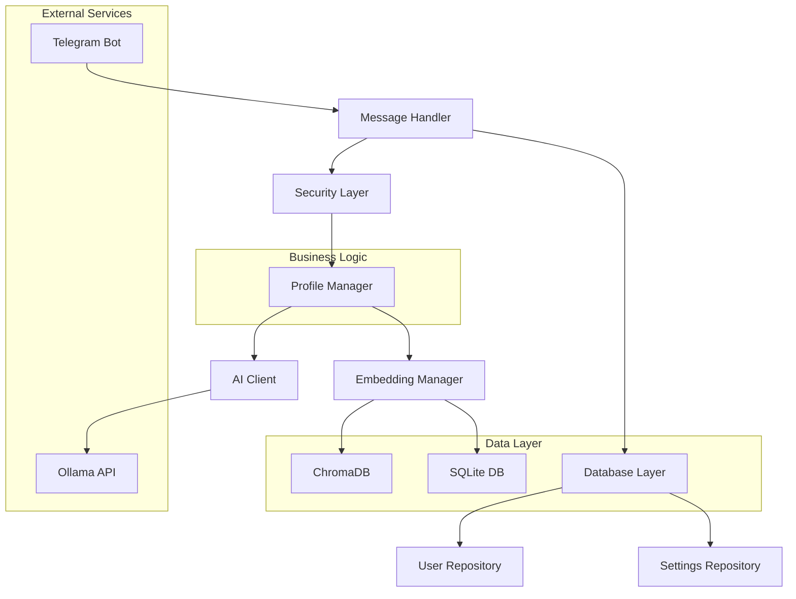
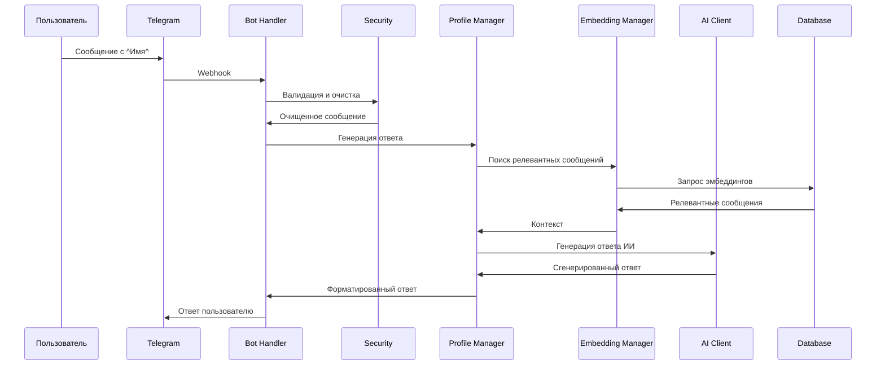

# 🤖 Telegram Bot - Генератор ответов в стиле участников

Проект представляет собой интеллектуального Telegram бота, который анализирует историю сообщений участников группы и генерирует ответы в их уникальном стиле с использованием технологий ИИ и векторного поиска.

## 📋 Оглавление

- [Особенности](#-особенности)
- [Архитектура](#-архитектура)
- [Технологический стек](#-технологический-стек)
- [Установка и настройка](#-установка-и-настройка)
- [Использование](#-использование)
- [API и интеграции](#-api-и-интеграции)
- [Мониторинг и здоровье](#-мониторинг-и-здоровье)
- [Безопасность](#-безопасность)
- [Тестирование](#-тестирование)
- [Развертывание](#-развертывание)
- [Разработка](#-разработка)

## 🚀 Особенности

- **🎭 Имитация стиля общения** - Анализ паттернов речи и генерация ответов в стиле конкретных участников
- **🔍 RAG (Retrieval-Augmented Generation)** - Использование релевантных сообщений из истории для более точных ответов
- **🧠 Векторный поиск** - ChromaDB для эффективного поиска похожих сообщений
- **⚡ Высокая производительность** - Асинхронная обработка и оптимизированные запросы
- **🔒 Безопасность** - Валидация входных данных, rate limiting, защита от XSS
- **📊 Мониторинг** - Полная система метрик и health checks
- **🐳 Контейнеризация** - Docker для простого развертывания
- **🧪 Тестирование** - Полный набор автоматических тестов

## 🏗️ Архитектура

### Общая архитектура системы



### Структура проекта

```
src/
├── config/           # ⚙️ Конфигурация (Pydantic)
│   ├── __init__.py
│   └── settings.py
├── database/         # 💾 Работа с данными
│   ├── __init__.py
│   ├── connection.py
│   ├── models.py
│   └── repository.py
├── ai/              # 🤖 ИИ интеграции
│   ├── __init__.py
│   └── ollama_client.py
├── embeddings/      # 🔍 Управление эмбеддингами
│   ├── __init__.py
│   └── manager.py
├── telegram/        # 📱 Telegram бот
│   ├── __init__.py
│   └── bot_handler.py
├── core/           # 🧠 Бизнес логика
│   ├── __init__.py
│   └── profile_manager.py
├── models/         # 📋 Модели данных
│   └── __init__.py
└── utils/          # 🔧 Утилиты
    ├── __init__.py
    ├── logging_config.py
    ├── security.py
    ├── health.py
    └── text_analyzer.py
```

### Поток обработки сообщений



## 🛠️ Технологический стек

### Основные компоненты
- **Python 3.11+** - Язык программирования
- **FastAPI** - Веб-фреймворк для API
- **SQLAlchemy** - ORM для работы с БД
- **Pydantic** - Валидация данных и настройки
- **ChromaDB** - Векторная база данных
- **Ollama** - Локальный ИИ сервер

### Библиотеки для Telegram
- **python-telegram-bot** - Telegram Bot API
- **aiohttp** - Асинхронные HTTP запросы

### Качество кода
- **mypy** - Статическая типизация
- **black** - Форматирование кода
- **flake8** - Линтинг
- **pytest** - Автоматическое тестирование

### Мониторинг и безопасность
- **structlog** - Структурированное логирование
- **psutil** - Мониторинг системных ресурсов
- **cryptography** - Криптографические функции

## 📦 Установка и настройка

### Системные требования

- Python 3.11+
- Ollama сервер
- 4GB+ RAM
- 10GB+ свободного места

### Установка зависимостей

```bash
# Клонирование репозитория
git clone <repository-url>
cd telegram-bot

# Создание виртуального окружения
python -m venv venv
source venv/bin/activate  # Linux/Mac
# или
venv\Scripts\activate     # Windows

# Установка зависимостей
pip install -r requirements.txt
```

### Настройка переменных окружения

Создайте файл `.env` на основе `.env.example`:

```bash
cp .env.example .env
```

Заполните необходимые переменные:

```env
# Telegram Bot
TELEGRAM_BOT_TOKEN=your_bot_token_here

# Ollama настройки
OLLAMA_URL=http://localhost:11434
OLLAMA_MODEL=yandex/YandexGPT-5-Lite-8B-instruct-GGUF:latest
OLLAMA_EMBEDDING_MODEL=nomic-embed-text

# Администратор
ADMIN_USER_ID=123456789

# Разрешенные чаты (опционально)
ALLOWED_CHAT_IDS=123456789,-1001234567890

# Пути к данным
DB_PROFILES=user_profiles.db
DB_EMBEDDINGS=./chroma_db
LOG_DIR=logs
```

### Запуск Ollama

```bash
# Установка и запуск Ollama
curl -fsSL https://ollama.ai/install.sh | sh
ollama serve

# Загрузка моделей
ollama pull yandex/YandexGPT-5-Lite-8B-instruct-GGUF:latest
ollama pull nomic-embed-text
```

### Инициализация базы данных

```bash
# Первый запуск для создания профилей
python src/main.py --load-messages --update-profiles

# Создание эмбеддингов
python src/main.py --update-embeddings
```

## 🎯 Использование

### Режимы работы

#### 1. Режим командной строки

```bash
# Загрузка сообщений из JSON
python src/main.py --load-messages

# Обновление профилей
python src/main.py --update-profiles

# Создание эмбеддингов
python src/main.py --update-embeddings

# Telegram режим
python src/main.py --telegram
```

#### 2. Docker

```bash
# Сборка образа
docker build -t telegram-bot .

# Запуск
docker run -d \
  --name telegram-bot \
  -v $(pwd)/data:/app/data \
  --env-file .env \
  telegram-bot
```

### Формат вопросов

```
Какая музыка тебе нравится ^Алексей^
Что думаешь о погоде ^Мария^
Расскажи о своем хобби ^Иван^
```

### Административные команды

```
/list - Показать список участников
/admin - Показать административные команды
/set_canonical_names <список> - Установить имена участников
/set_allowed_chat_ids <список> - Ограничить доступ к чатам
/get_ollama_models - Показать доступные модели ИИ
/update_embeddings - Обновить базу знаний
```

## 🔗 API и интеграции

### REST API (опционально)

```python
from fastapi import FastAPI
from src.core.profile_manager import ProfileManager

app = FastAPI()
manager = ProfileManager()

@app.post("/generate")
async def generate_response(question: str, user: str):
    return await manager.generate_response(question, user)
```

### Webhook интеграции

```python
from src.telegram.bot_handler import TelegramBotHandler

# Создание обработчика
handler = TelegramBotHandler()

# Регистрация webhook
await handler.setup_webhook("https://your-domain.com/webhook")
```

### Метрики и мониторинг

```python
from src.utils.health import get_health_status

# Проверка здоровья
status = get_health_status()
print(f"Status: {status['status']}")
```

## 📊 Мониторинг и здоровье

### Health Checks

```bash
# Проверка здоровья всех компонентов
curl http://localhost:8000/health

# Ответ
{
  "status": "healthy",
  "timestamp": "2025-11-21T08:00:00",
  "service": "telegram-bot",
  "version": "1.0",
  "checks": {
    "database": {"status": "healthy", "profiles_count": 15},
    "ollama": {"status": "healthy", "models_available": 5},
    "embeddings": {"status": "healthy", "total_embeddings": 1250},
    "system": {"status": "healthy", "memory_percent": 45.2}
  }
}
```

### Метрики

Автоматически собираются метрики:
- Количество обработанных запросов
- Время ответа ИИ
- Использование памяти
- Ошибки и исключения

### Логирование

```python
import logging
from src.utils import get_logger

logger = get_logger(__name__)
logger.info("Обработка запроса", user_id=123, response_time=1.2)
```

## 🔒 Безопасность

### Меры безопасности

- **Валидация входных данных** - Все входные данные проверяются и очищаются
- **Rate limiting** - Ограничение частоты запросов (10 запросов/минуту)
- **XSS защита** - Экранирование HTML и фильтрация опасных тегов
- **SQL injection защита** - Параметризованные запросы
- **Принцип наименьших привилегий** - Минимальные права для компонентов

### Аудит и логи

```python
# Все подозрительные действия логируются
logger.warning("Rate limit exceeded", user_id=user_id, ip=ip_address)

# Аудит административных действий
logger.info("Admin command executed",
           admin_id=admin_id,
           command=command,
           target_chat=chat_id)
```

## 🧪 Тестирование

### Запуск тестов

```bash
# Все тесты
pytest

# С покрытием
pytest --cov=src --cov-report=html

# Конкретный модуль
pytest tests/test_ai.py

# С подробным выводом
pytest -v --tb=short
```

### Структура тестов

```
tests/
├── __init__.py
├── conftest.py          # Фикстуры
├── test_config.py       # Тесты конфигурации
├── test_ai.py          # Тесты ИИ клиента
├── test_database.py    # Тесты базы данных
├── test_security.py    # Тесты безопасности
└── test_embeddings.py  # Тесты эмбеддингов
```

### Примеры тестов

```python
def test_ollama_client_generation():
    client = OllamaClient()
    response = client.generate_text("Hello")
    assert len(response) > 0
    assert isinstance(response, str)

def test_input_validation():
    validator = InputValidator()
    assert validator.validate_username("valid_user_123")
    assert not validator.validate_username("invalid@#$%")
```

## 🚢 Развертывание

### Docker Compose

```yaml
version: '3.8'
services:
  telegram-bot:
    build: .
    env_file: .env
    volumes:
      - ./data:/app/data
      - ./logs:/app/logs
    restart: unless-stopped
    healthcheck:
      test: ["CMD", "python", "-c", "from src.utils.health import health_checker; exit(0 if health_checker.is_healthy() else 1)"]
      interval: 30s
      timeout: 10s
      retries: 3

  ollama:
    image: ollama/ollama:latest
    volumes:
      - ./ollama:/root/.ollama
    ports:
      - "11434:11434"
```

### Kubernetes

```yaml
apiVersion: apps/v1
kind: Deployment
metadata:
  name: telegram-bot
spec:
  replicas: 2
  selector:
    matchLabels:
      app: telegram-bot
  template:
    metadata:
      labels:
        app: telegram-bot
    spec:
      containers:
      - name: telegram-bot
        image: your-registry/telegram-bot:latest
        envFrom:
        - secretRef:
            name: telegram-bot-secrets
        resources:
          requests:
            memory: "512Mi"
            cpu: "250m"
          limits:
            memory: "1Gi"
            cpu: "500m"
        livenessProbe:
          httpGet:
            path: /health
            port: 8000
          initialDelaySeconds: 30
          periodSeconds: 10
```

### CI/CD

```yaml
# .github/workflows/deploy.yml
name: Deploy
on:
  push:
    branches: [main]

jobs:
  test:
    runs-on: ubuntu-latest
    steps:
    - uses: actions/checkout@v3
    - name: Run tests
      run: |
        python -m pytest --cov=src --cov-report=xml
    - name: Build and push Docker image
      run: |
        docker build -t telegram-bot .
        docker tag telegram-bot your-registry/telegram-bot:$GITHUB_SHA
        docker push your-registry/telegram-bot:$GITHUB_SHA
```

## 💻 Разработка

### Настройка среды разработки

```bash
# Установка инструментов разработки
pip install -r requirements-dev.txt

# Настройка pre-commit hooks
pre-commit install

# Запуск линтера и форматтера
black src/
flake8 src/
mypy src/
```

### Добавление нового функционала

1. **Создание модели данных**
```python
# src/models/new_feature.py
from pydantic import BaseModel

class NewFeatureData(BaseModel):
    field1: str
    field2: Optional[int] = None
```

2. **Добавление репозитория**
```python
# src/database/new_repository.py
from src.database.models import NewFeatureData

class NewFeatureRepository:
    def save(self, data: NewFeatureData) -> bool:
        # Логика сохранения
        pass
```

3. **Бизнес логика**
```python
# src/core/new_manager.py
from src.database.new_repository import NewFeatureRepository

class NewFeatureManager:
    def __init__(self):
        self.repo = NewFeatureRepository()

    def process_feature(self, data: dict):
        # Обработка данных
        pass
```

4. **Добавление API**
```python
# src/telegram/bot_handler.py
async def new_feature_command(self, update: Update, context):
    # Обработка команды
    pass
```

### Лучшие практики

- **Типизация** - Используйте type hints для всех функций
- **Документация** - Добавляйте docstrings ко всем публичным методам
- **Тестирование** - Написывайте тесты для нового кода
- **Логирование** - Логируйте важные события и ошибки
- **Безопасность** - Всегда валидируйте входные данные

## 📈 Производительность

### Оптимизации

- **Асинхронная обработка** - Все I/O операции асинхронны
- **Кэширование** - Эмбеддинги и профили кэшируются в памяти
- **Батчинг** - Групповая обработка запросов к Ollama
- **Индексы БД** - Оптимизированные запросы к SQLite

### Метрики производительности

```
Response Time (P95): < 3 seconds
Memory Usage: < 1GB
CPU Usage: < 20%
Concurrent Users: > 50
```

## 🤝 Contributing

1. Fork the repository
2. Create feature branch (`git checkout -b feature/amazing-feature`)
3. Commit changes (`git commit -m 'Add amazing feature'`)
4. Push to branch (`git push origin feature/amazing-feature`)
5. Open Pull Request

## 📝 Лицензия

This project is licensed under the MIT License - see the [LICENSE](LICENSE) file for details.

## 🙏 Благодарности

- [python-telegram-bot](https://github.com/python-telegram-bot/python-telegram-bot)
- [Ollama](https://ollama.ai/)
- [ChromaDB](https://www.trychroma.com/)
- [Pydantic](https://pydantic-docs.helpmanual.io/)

---

**Примечание:** Этот проект предназначен для образовательных и исследовательских целей. Убедитесь, что использование соответствует правилам платформы Telegram и применимому законодательству.
